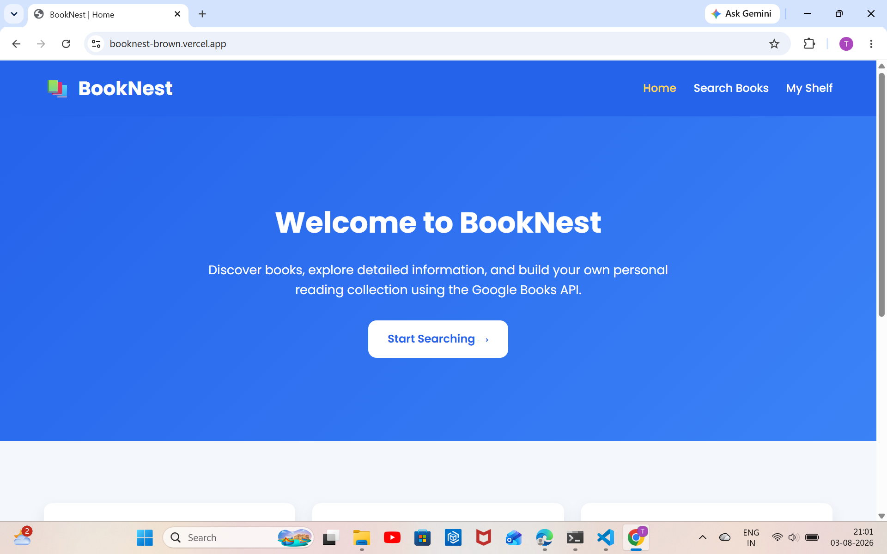
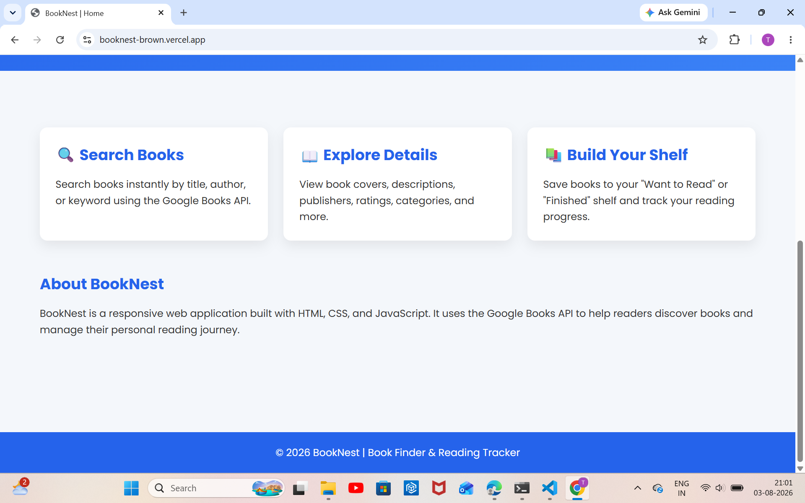
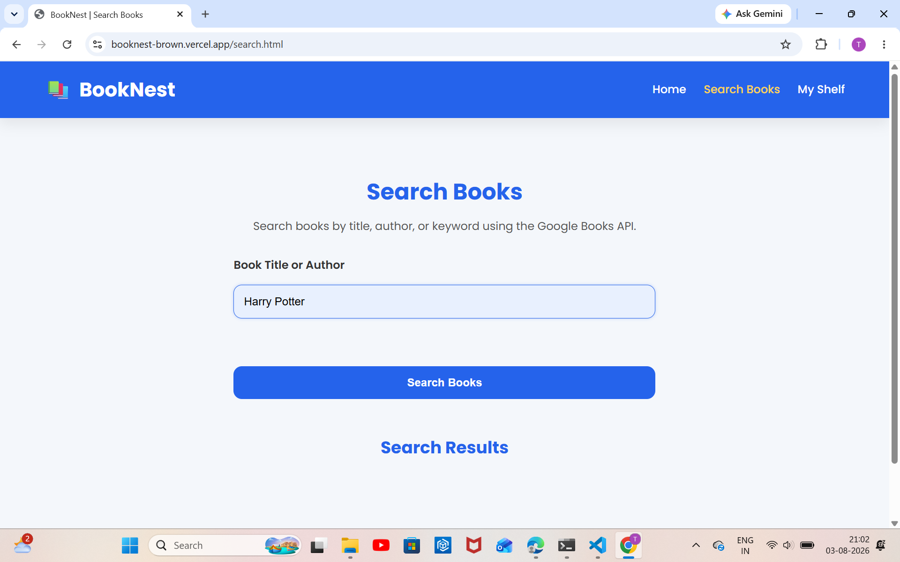
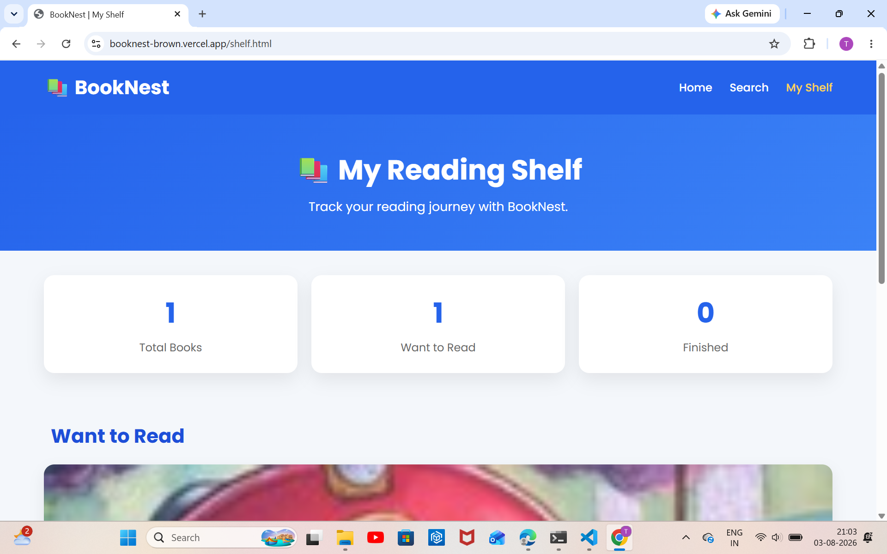

# 📚 BookNest – Book Finder & Reading Tracker

BookNest is a responsive web application that helps users discover books using the **Google Books API**, explore detailed book information, and manage their personal reading shelf. Built with **HTML, CSS, and JavaScript**, the project provides a clean, responsive, and user-friendly reading experience without using any frontend frameworks.

---

# ✨ Features

- 🔍 Search books by title, author, or keyword using the Google Books API
- 📖 View detailed information about each book
- 📚 Add books to a personal reading shelf
- ⭐ Mark books as **Want to Read** or **Finished**
- 💾 Save reading shelf using Local Storage
- 📊 Track reading progress
- ⏳ Loading indicator while fetching book data
- ⚠️ Error handling for failed API requests
- 📭 Display **No Results Found** for empty searches
- ✅ Client-side form validation
- 📱 Fully responsive design for desktop, tablet, and mobile devices
- 🎨 Consistent UI with reusable styling and navigation

---

# 📸 Screenshots

### 🏠 Home Page



### 🏡 Home Page (Alternate View)



### 🔍 Search Page



### 📚 Search Results


### 📖 Book Details


### 📚 My Shelf



---

# 🛠️ Technologies Used

- HTML5
- CSS3
- JavaScript (ES6)
- Google Books API
- Local Storage
- Git
- GitHub
- Vercel

---

# 📂 Project Structure

```text
BookNest/
│── index.html
│── search.html
│── details.html
│── shelf.html
│
├── css/
│   ├── style.css
│   ├── search.css
│   ├── details.css
│   └── shelf.css
│
├── js/
│   ├── search.js
│   ├── details.js
│   └── shelf.js
│
├── assets/
│   └── images/
│
├── screenshots/
│   ├── home.png
│   ├── home2.png
│   ├── search.png
│   ├── search result.png
│   ├── view details.png
│   └── shelf.png
│
└── README.md
```

---

# 👥 Team Members

- **Thillai Eswari T**
- **Varshaa A.S**

---

# 📋 Work Distribution

## 👩‍💻 Thillai Eswari T

- Designed and developed the Home page
- Developed the Search page
- Integrated the Google Books API
- Implemented book search functionality using `fetch()`
- Added loading, error, and no-results states
- Implemented client-side search validation
- Built responsive search result cards
- Maintained responsive UI and shared styling
- Assisted in testing and deployment

## 👩‍💻 Varshaa A.S

- Developed the Book Details page
- Developed the My Shelf page
- Implemented Local Storage to save user data
- Added functionality to add and remove books from the reading shelf
- Developed the Reading Progress Tracker
- Displayed book information including title, author, cover image, and description
- Ensured responsive design across desktop and mobile devices
- Tested and verified implemented features

---

# 🌱 What We Learned

## 👩‍💻 Thillai Eswari T

During this project, I learned:

- Working with REST APIs using the Google Books API
- Fetching and displaying dynamic data using JavaScript `fetch()`
- Handling loading, error, and no-results states
- Building responsive user interfaces with HTML and CSS
- Implementing client-side validation
- Using Git and GitHub for version control and team collaboration
- Deploying web applications using Vercel

## 👩‍💻 Varshaa A.S

During this project, I learned:

- Using Local Storage to persist user data
- Building dynamic Book Details and My Shelf pages
- Managing reading progress functionality
- Creating responsive and reusable UI components
- Testing and debugging JavaScript features
- Collaborating effectively using Git and GitHub

---

# 🔗 Google Books API

### API Endpoint

```text
https://www.googleapis.com/books/v1/volumes?q={searchTerm}
```

No API key is required for basic book searches.

---

# ▶️ How to Run Locally

1. Clone the repository.

```bash
git clone https://github.com/varshaasvam16-bit/Book_Nest.git
```

2. Open the project folder in Visual Studio Code.
3. Open `index.html` in your preferred web browser.
4. Navigate to the **Search** page.
5. Search for books by title, author, or keyword.

---

# 🧪 Testing Checklist

- ✅ Book search using Google Books API
- ✅ Loading state displayed while fetching data
- ✅ Error message displayed when the API request fails
- ✅ "No Results Found" displayed correctly
- ✅ Client-side search validation
- ✅ Responsive layout tested on desktop, tablet, and mobile devices
- ✅ Navigation links verified
- ✅ Book Details page tested
- ✅ My Shelf functionality tested
- ✅ Local Storage saving and retrieving data verified

---

# 📌 Project Status

## ✅ Completed

- Home Page
- Search Page
- Google Books API Integration
- Book Details Page
- My Shelf
- Local Storage Integration
- Reading Progress Tracking
- Loading & Error States
- Search Validation
- Responsive Design
- Shared Navigation & Styling

---

# 🔮 Future Enhancements

- 🌙 Dark Mode
- ❤️ Favorites / Wishlist
- 📄 Pagination for search results
- 🏷️ Search by categories and genres
- 📊 Reading statistics dashboard
- 🔐 User authentication
- ☁️ Cloud synchronization across devices

---

# 🌐 Live Demo

🔗 https://booknest-brown.vercel.app

---

# 📂 Repository

🔗 https://github.com/varshaasvam16-bit/Book_Nest

---

# 📄 License

This project was developed as part of the **ZyoraByte Frontend Developer Internship Program** for educational and learning purposes.